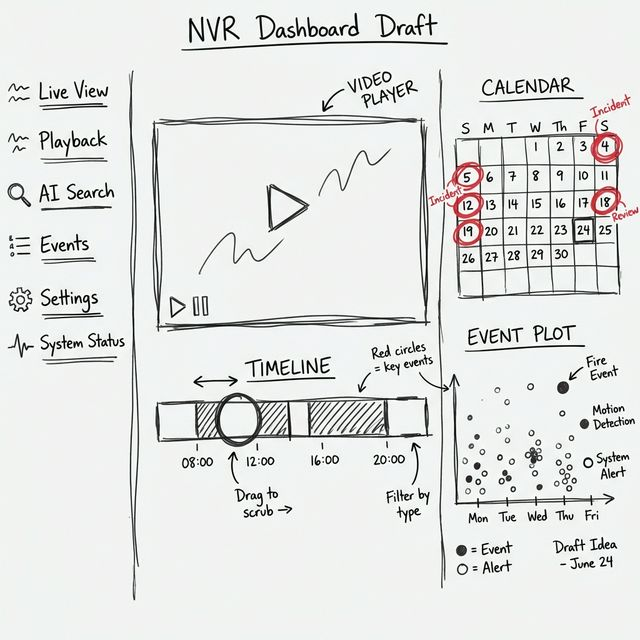

# NVR Dashboard Redesign Proposal

## Concept: Modern & Minimalist
We aim to move away from the "functional but dated" look to a modern, application-style interface.

### Key Changes
1.  **Sidebar Navigation**: Replaces the top menu for better scalability and a cleaner look.
2.  **Card-Based Layout**: Groups related information (Settings, Sessions, Camera Feeds) into distinct, floating cards with subtle shadows.
3.  **Visual Hierarchy**: clear distinction between "Configuration" (Top) and "Monitoring" (Bottom).
4.  **Status Indicators**: Use of vibrant colors (Green/Red) and badges to show system status at a glance.

### Lo-Fi Wireframe (Conceptual Layout)
Here is the layout draft in "Hand-drawn" style to visualize the structure before we build:

### Key Components
1.  **Timeline Scrubber (Bottom)**: Simple slider for video seeking.
2.  **Smart Calendar (Top Right)**: Filter events by date.
3.  **Event Plot (Bottom Right)**: Density map of events (Fire/Smoke) over time.

